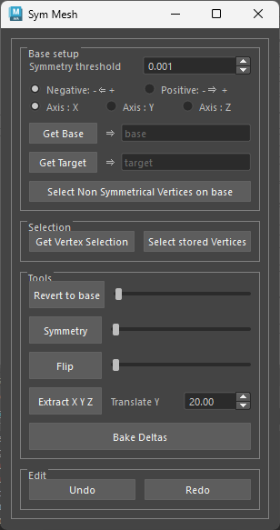
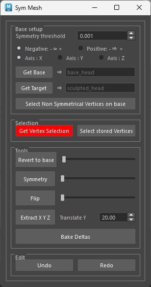
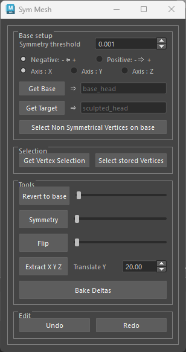

# Maya sym mesh
This is a Maya project for mesh modification, including unittest setup

## Installation
To install this package for your local maya, you can use the following command in a `TERMINAL` in
**_ADMINISTRATOR MODE_**: 
```commandline
mayapy -m pip install {package location} -r {package location}/requirements.txt
```
Where `{package location}` represents the location where you downloaded the package, for example :
```commandline
mayapy -m pip install D:/python/sym-mesh -r D:/python/sym-mesh/requirements.txt
```
If you have more than one maya version installed, you will need to replace `mayapy` with the full
path to your `mayapy` executable file, like so : 
```commandline
"C:\Program Files\Autodesk\Maya2022\bin\mayapy.exe" -m pip install D:/python/sym-mesh -r D:/python/sym-mesh/requirements.txt
```
Note that on Windows you will have to put the path in quotation marks if there are any blank spaces in it, as
Windows can't handle those.

## Launch
You can currently launch the tool with the current command :

```python
from sym_mesh.gui import startup

startup.startup()
```


# How to use it?

## GUI Look

* Open the `sym_mesh` tool by running the command from the previous section in the script editor.



## General settings
By default, the tool uses the X axis from positive to negative (+X to -X) as the symmetry axis for 
all operations, but you can change this by selecting the desired axis from the `Base setup` section.

The symmetry threshold is set to `0.001` by default, but you can change this value to adjust the 
value used to detect symmetry for the base mesh and build the symmetry table. If your base mesh is 
not symmetrical, you can try setting a higher threshold.

<div style="background-color:#d4edda; color:#155724; padding:10px; border-radius:5px; border:1px solid #c3e6cb; margin:10px 0;">
  <strong>Note:</strong> In the case of a non-symmetrical base mesh, you can use the `Select Non Symmetrical Vertices on base` button to select the vertices that are not symmetrical, which will help you identify the non-symmetrical parts of the mesh.
</div>

Setting a higher symmetry threshold will help you build a symmetry table for the base mesh for
meshes that are close to symmetrical but aren't perfectly symmetrical. You can then select that mesh
and symmetrize it using the [Symmetry operation](#symmetrize-mesh), 
allowing you to make your base mesh perfectly symmetrical in some instances. This won't work for 
very asymmetrical meshes however, but it can help with meshes that are mostly symmetrical with some 
minor asymmetries.

## Check base mesh for symmetry
* Select your base mesh in the scene and click the `Get Base` button.
* Click the `Select Non Symmetrical Vertices on base` button to select the vertices that are not symmetrical.

<div style="background-color:#d4edda; color:#155724; padding:10px; border-radius:5px; border:1px solid #c3e6cb; margin:10px 0;">
  <strong>Note:</strong> Keep in mind that this operation is based on the threshold set in the `Symmetry Threshold` spinbox.
</div>


## Selection based operations

### Vertex selection
For each of the selection based operations (`revert to base`, `symmetry`, `flip`, `bake deltas`), you can either:
* Select the vertices you want to operate on in the viewport, or
* Store a selection of vertices to operate on for subsequent operations, or
* Work on the whole mesh by not selecting any vertices.

The operations will be applied to the stored vertex selection, even if you select new vertices in 
the viewport. If no vertex selection is stored, the operations will be applied to the vertices
currently selected in the viewport. If there is no vertex selection stored, and no vertices selected
in the viewport, the operations will be applied to the selected mesh in its entirety.

To store a vertex selection, select the vertices you want to operate on and click the `Get Vertex Selection` button (which will make it turn red).



If you want to remove the stored vertex selection, you can click the `Get Vertex Selection` button again, which will revert it to gray.

If you want to create a new vertex selection, you must first remove the stored vertex selection by clicking the `Get Vertex Selection` button, then select the new vertices you want to operate on and click the `Get Vertex Selection` button again.



### Revert to base
* Select your base mesh in the scene and click the `Get Base` button.
* Select the target mesh in the scene.
* Use the `Revert to Base` slider to revert the selected vertices (or entire target mesh) to the point position of the base mesh.

See the [Vertex selection](#vertex-selection) section above for how to select vertices and selection priority order.

### Symmetrize mesh
* Select your base mesh in the scene and click the `Get Base` button.
* Select the target mesh in the scene.
* Use the `Symmetry` slider to symmetrize the selected vertices (or entire target mesh) based on the base mesh.

See the [Vertex selection](#vertex-selection) section above for how to select vertices and selection priority order.

### Flip mesh
* Select your base mesh in the scene and click the `Get Base` button.
* Select the target mesh in the scene.
* Use the `Flip` slider to flip the selected vertices (or entire target mesh) based on the base mesh.

See the [Vertex selection](#vertex-selection) section above for how to select vertices and selection priority order.

### Extract X, Y, Z
The `Extract XYZ` operation allows you to extract the X, Y, and Z coordinates of the target mesh 
vertices and apply them as blendshapes (one for the X axis, one for the Y axis, and one for the Z
axis) to a copy of the base mesh. This allows for easy creation of blendshapes by allowing the user
to manipulate the intensity of X, Y, or Z coordinates of the points of the target mesh independently.
The base mesh is first duplicated and placed in the scene above the target mesh based on the 
distance set in the `Translate Y` spinbox, then the X, Y, and Z coordinates of the target mesh 
vertices are extracted to separate meshes and applied as blendshapes to the duplicated base mesh
(after which the meshes are deleted, leaving only one duplicated mesh with the blendshapes on it).

<div style="background-color:#d4edda; color:#155724; padding:10px; border-radius:5px; border:1px solid #c3e6cb; margin:10px 0;">
  <strong>Note:</strong> The naming of the new mesh is based on the selected mesh name. For example, if the target mesh is named `target_mesh`, the new mesh will be named `target_mesh_extracted`.
</div>


To use the `Extract XYZ` operation, follow these steps:
* Select your base mesh in the scene and click the `Get Base` button.
* Select the target mesh in the scene.
* Use the `Extract XYZ` slider to extract the X, Y, or Z coordinates of the target mesh vertices and apply them as blendshapes to a copy of the base mesh.


## Target based operations

### Bake Deltas
The bake deltas operation allows you to bake the deltas between the base mesh and the target mesh into
a selection of meshes.

To use the `Bake Deltas` operation, follow these steps:
* Select your base mesh in the scene and click the `Get Base` button.
* Select the target mesh in the scene and click the `Get Target` button.
* Select the meshes you want to bake the delta on into in the scene.
* Use the `Bake Deltas` button to bake the delta between the base mesh vertices' position and the target mesh's vertices position onto the selected meshes.

## Notes
In order to use interactive sliders for the `Revert to Base`, `Symmetry`, and `Flip` operations, a
custom undo mechanism had to be implemented, instead of Maya's default undo mechanism when using
MPxCommand. This is because using MPxCommand would cause each call to the command (and therefore
every single pixel movement of the sliders) to create a new undo step, which would lead to a very
large number of undo steps being created thus making the undo stack essentially unusable. The
custom undo mechanism allows for a single undo step to be created for the entire operation, which
is more efficient and improves usability.

As a result, the undo and redo operations can be performed using the `Undo` and `Redo` buttons at
the bottom the GUI, which will undo or redo the last operation performed using the GUI. Be mindful
that this undo mechanism essentially stores a handle to the mesh that was modified as well as the
points positions of that mesh before and after the operation, which means that modifying meshes
manually after an operation and then undoing that operation can lead to unexpected results, as the
custom undo mechanism only tracks the operations performed using the GUI and not any manual
modifications made to the meshes.


# Development

## How to install coverage on Maya?

### On Windows, from an ***administrator*** command line :
```commandline
mayapy -m pip install --ignore-installed coverage
```
The `ignore-install` flag is a nice thing to know when you want to ensure you get the latest version
or when the package in question is already installed somewhere else on your machine, but isn't
available to Maya.

### On both macOS and Linux, the following command can be used :
```commandline
sudo ./mayapy -m pip install <flags> <package>
```

### For more information, the coverage documentation can be found here :
https://coverage.readthedocs.io/en/6.4.3/cmd.html#

## How to run coverage on Maya?
Tests can be run with coverage on maya by calling the coverage executable with the maya interpreter, this would
look something like this : 
```commandline
C:\Program Files\Autodesk\Maya2022\bin\mayapy "C:\Program Files\Autodesk\Maya2022\Python37\Scripts\coverage.exe" run --source=src -m unittest
```
On Windows, it is important that the coverage executable be in quotes (") so that the interpreter can read it as a path (due to the space issue mentioned at the top).

Then the html report can be generated with the following command (that you can add to the tox
`commands` section of the environments to run, when using tox):
```commandline
coverage html -d coverage_html
```

# Features Roadmap

* build `symmetry table` (local space vertices position)
* build `symmetry table` (topology)
* Geometry operations with a spinbox in addition to the button
* Add click/drag and ctrl/click/drag events to spinboxes
* Geometry operations `from target` or `from selection`
* Adding coloring of geometry operations based on the active mode (`from selection` or `from target`)
* testing and push reject on github
* Pip integration