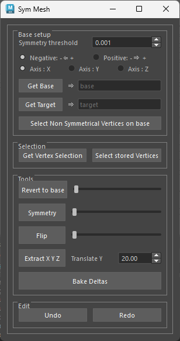
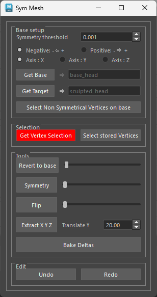
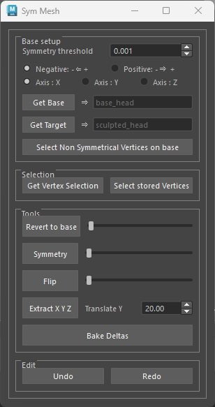

# Maya sym mesh
This is a Maya project for mesh modification, including unittest setup

## Installation

### 1. Download the project

Clone or download the repository from GitHub:

```commandline
git clone https://github.com/martinlanton/sym_mesh.git
```

Or download the ZIP archive from
[https://github.com/martinlanton/sym_mesh/tree/master](https://github.com/martinlanton/sym_mesh/tree/master)
and extract it to a folder of your choice.

### 2. Install the package for Maya

Open a terminal **as administrator** and run:

```commandline
mayapy -m pip install <path-to-sym-mesh> -r <path-to-sym-mesh>/requirements.txt
```

Replace `<path-to-sym-mesh>` with the folder where you cloned or extracted the project. For
example:

```commandline
mayapy -m pip install D:/python/sym-mesh -r D:/python/sym-mesh/requirements.txt
```

> **Note:** If you have multiple Maya versions installed, replace `mayapy` with the full path to
> the desired version's executable:
> ```commandline
> "C:\Program Files\Autodesk\Maya2022\bin\mayapy.exe" -m pip install D:/python/sym-mesh -r D:/python/sym-mesh/requirements.txt
> ```
> On Windows, wrap the path in quotes when it contains spaces.

## Launch
You can currently launch the tool with the current command :

```python
from sym_mesh.gui import startup

startup.startup()
```


# How to use it?

## GUI overview

Open the tool by running the launch command from the previous section in Maya's script editor.



### General workflow

Most operations follow the same pattern:

1. Configure the **Base Setup** settings (axis, direction, threshold).
2. Select your base mesh and click **Get Base**.
3. Select the mesh you want to modify in the viewport.
4. Use the desired tool (button for instant 100% application, or slider for interactive control).

## Base setup

### Axis

Choose the symmetry axis (**X**, **Y**, or **Z**). Default is **X**.

### Direction

Choose which side of the axis is the **source** (i.e. the side whose vertex positions are preserved
and mirrored onto the other side):

* **Positive (- ⇒ +)** — the negative side is the source, mirrored onto the positive side.
* **Negative (- ⇐ +)** — the positive side is the source, mirrored onto the negative side.

### Symmetry threshold

Controls how close two vertices must be (after mirroring across the axis) to be considered
a symmetrical pair. Default is `0.001`.

> **Tip:** If your base mesh is not perfectly symmetrical, try raising the threshold. You can then
> symmetrize the base mesh itself to make it perfectly symmetrical — this works for meshes with
> minor asymmetries but not for heavily asymmetrical meshes.

### Checking base mesh symmetry

1. Select your base mesh and click **Get Base**.
2. Click **Select Non Symmetrical Vertices on base** to highlight vertices that have no symmetrical
   counterpart (based on the current threshold).

## Vertex selection

The **Revert to Base**, **Symmetry**, **Flip**, and **Bake Deltas** operations can be applied to a
subset of vertices instead of the whole mesh. The priority order is:

1. **Stored selection** — if vertices have been stored, they are always used.
2. **Live viewport selection** — if no stored selection exists, the currently selected vertices are used.
3. **Whole mesh** — if neither of the above exists, the operation applies to every vertex.

To **store** a selection, select vertices in the viewport and click **Get Vertex Selection** (the
button turns red to indicate a stored selection is active).



To **clear** the stored selection, click the (red) **Get Vertex Selection** button again (it reverts
to gray).

To **re-select** stored vertices in the viewport, click **Select stored Vertices**.

> **Note:** To change the stored selection, you must first clear it, then select new vertices and
> store them again.



## Tools

> All tools below respect the [vertex selection](#vertex-selection) priority described above, unless
> noted otherwise.

### Revert to base

Moves vertices on the selected mesh back toward the base mesh position.

* Click **Revert to base** to apply at 100%, or drag the slider for interactive control.

### Symmetrize

Mirrors vertex positions across the symmetry axis using the base mesh's symmetry table.

* Click **Symmetry** to apply at 100%, or drag the slider for interactive control.

### Flip

Swaps vertex positions across the symmetry axis (each vertex trades places with its symmetrical
counterpart).

* Click **Flip** to apply at 100%, or drag the slider for interactive control.

### Extract X Y Z

Splits the difference between the selected mesh and the base mesh into separate X, Y, and Z
components, then applies them as blendshape targets on a duplicate of the base mesh. This lets you
control each axis of the deformation independently.

* The duplicate is placed above the target mesh by the distance set in the **Translate Y** spinbox
  (default `20`).
* The new mesh is named `<selected_mesh>_extracted`.

> **Note:** This operation always applies to the entire mesh (vertex selection is ignored).

### Bake Deltas

Bakes the difference between the base mesh and a **stored** target mesh onto one or more selected
meshes.

1. Select your base mesh and click **Get Base**.
2. Select the target mesh and click **Get Target**.
3. Select the mesh(es) you want to bake onto in the viewport.
4. Click **Bake Deltas**.

> **Note:** Unlike the other tools, Bake Deltas uses the target stored via the **Get Target**
> button, not the currently selected mesh in the viewport.

## Undo & Redo

The tool uses a **custom undo/redo stack** (separate from Maya's native undo) so that interactive
slider operations create only a single undo step instead of one per slider tick.

* **GUI buttons:** Use the **Undo** / **Redo** buttons at the bottom of the window.
* **Keyboard shortcuts:** `Ctrl+Z` (undo) and `Ctrl+Shift+Z` (redo) while the tool window is
  focused.

> **Warning:** The custom undo stack only tracks operations performed through the tool. If you
> manually edit a mesh between tool operations and then undo, the result may be unexpected because
> the stored undo state won't account for your manual edits.


# Development

## How to install coverage on Maya?

### On Windows, from an ***administrator*** command line :
```commandline
mayapy -m pip install --ignore-installed coverage
```
The `ignore-install` flag is a nice thing to know when you want to ensure you get the latest version
or when the package in question is already installed somewhere else on your machine, but isn't
available to Maya.

### On both macOS and Linux, the following command can be used :
```commandline
sudo ./mayapy -m pip install <flags> <package>
```

### For more information, the coverage documentation can be found here :
https://coverage.readthedocs.io/en/6.4.3/cmd.html#

## How to run coverage on Maya?
Tests can be run with coverage on maya by calling the coverage executable with the maya interpreter, this would
look something like this : 
```commandline
C:\Program Files\Autodesk\Maya2022\bin\mayapy "C:\Program Files\Autodesk\Maya2022\Python37\Scripts\coverage.exe" run --source=src -m unittest
```
On Windows, it is important that the coverage executable be in quotes (") so that the interpreter can read it as a path (due to the space issue mentioned at the top).

Then the html report can be generated with the following command (that you can add to the tox
`commands` section of the environments to run, when using tox):
```commandline
coverage html -d coverage_html
```

# Features Roadmap

* build `symmetry table` (local space vertices position)
* build `symmetry table` (topology)
* Geometry operations with a spinbox in addition to the button
* Add click/drag and ctrl/click/drag events to spinboxes
* Geometry operations `from target` or `from selection`
* Adding coloring of geometry operations based on the active mode (`from selection` or `from target`)
* testing and push reject on github
* Pip integration